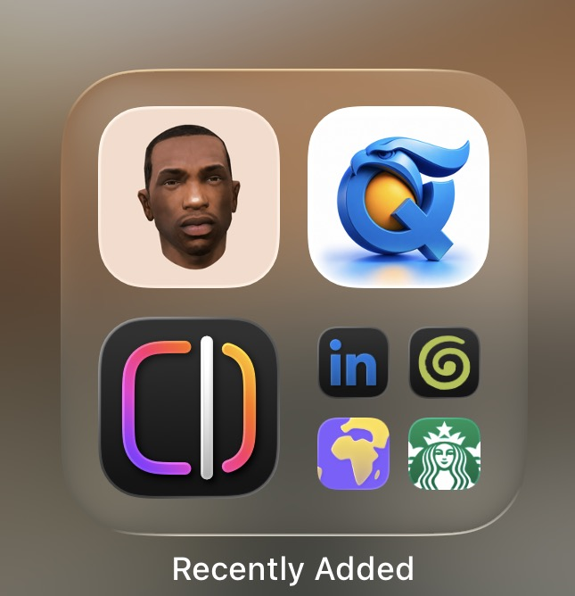
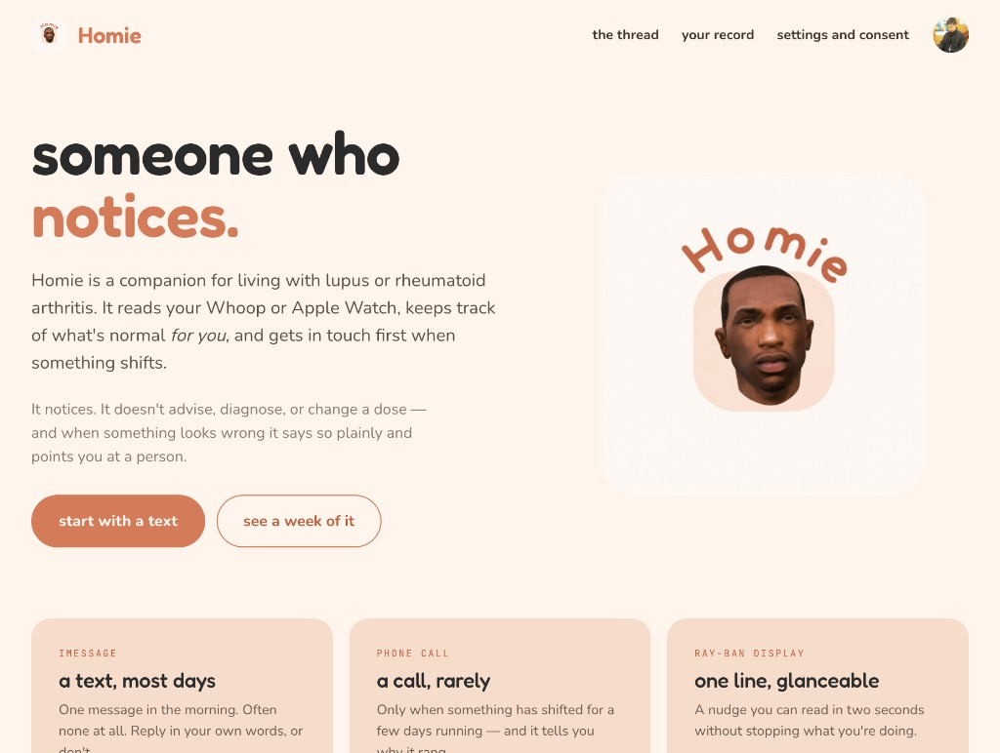
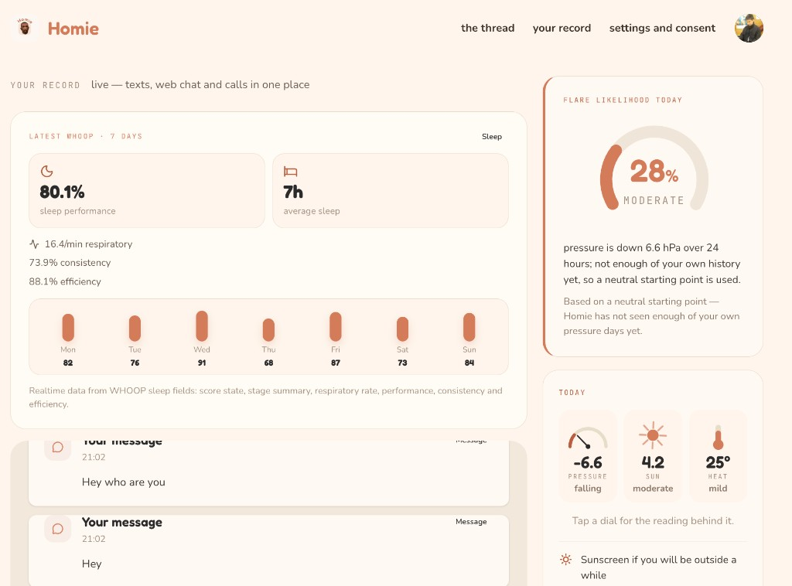
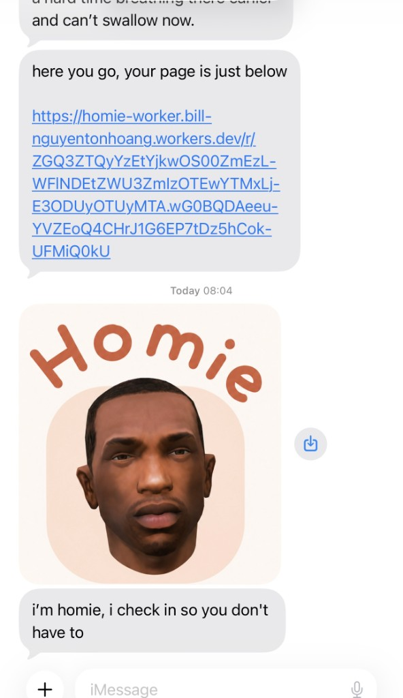
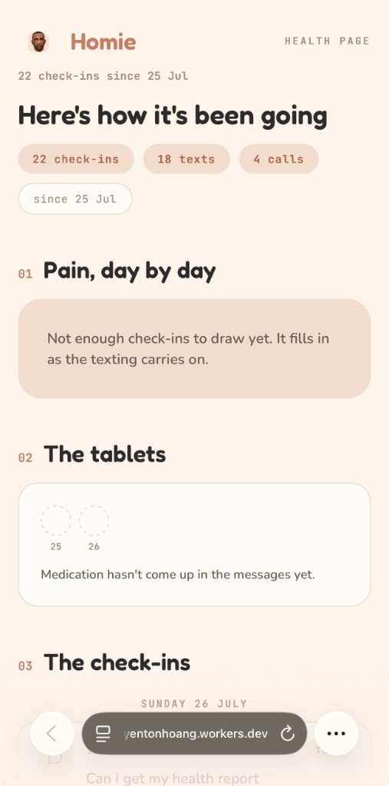
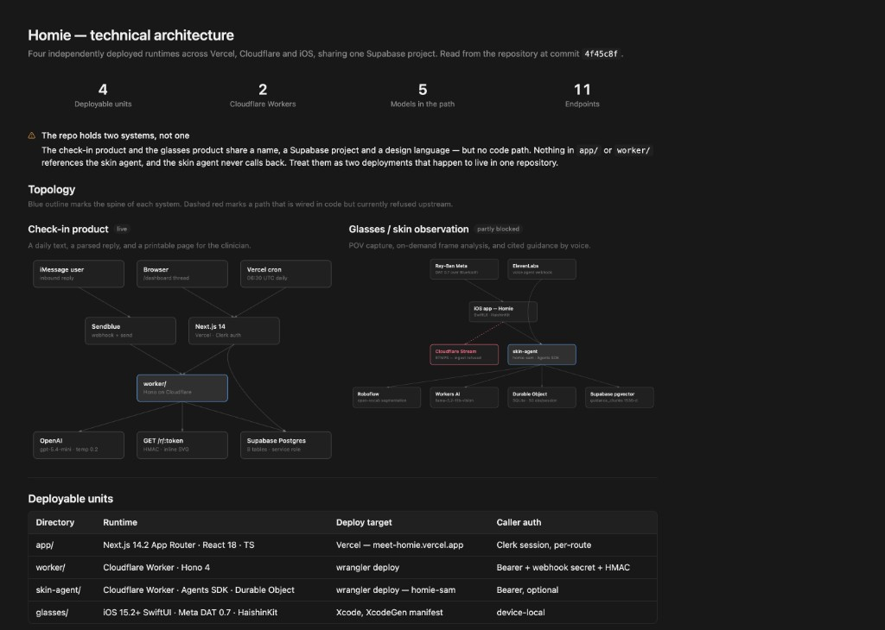
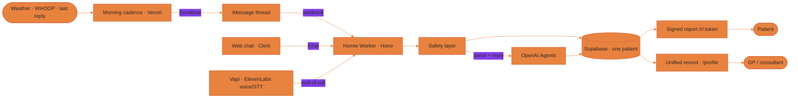

<div align="center">

# Homie

**Someone who notices.**

Homie is a multimorbidity companion that works from a phone number alone. Morning texts, calls when something shifts, and a live web record. Ask in iMessage for your health report and Homie texts back a signed printable link for the clinician. Homie notices and routes. It never advises a dose or diagnoses.

### Live app · Project deck

| | |
| --- | --- |
| **Live app** | **[https://meet-homie.vercel.app](https://meet-homie.vercel.app)** |
| **Project deck** | **[Homie Deck (standalone)](https://1f13145c-fa28-447a-a5d5-63d3b11db6a9.claudeusercontent.com/v1/design/projects/1f13145c-fa28-447a-a5d5-63d3b11db6a9/serve/Homie%20Deck%20(standalone).html?t=63ea9d7b47163ba98ca83c5c8a68c59da1f6b06075d0f101c94ba0e6e72e97a1.b58a3912-da06-4ff6-84a7-b3fa665dc4fc.6fd6779e-ea70-489e-b9b2-1d2a1b841921.1785071068.fp&direct=1)** |

[](https://meet-homie.vercel.app)
[](https://1f13145c-fa28-447a-a5d5-63d3b11db6a9.claudeusercontent.com/v1/design/projects/1f13145c-fa28-447a-a5d5-63d3b11db6a9/serve/Homie%20Deck%20(standalone).html?t=63ea9d7b47163ba98ca83c5c8a68c59da1f6b06075d0f101c94ba0e6e72e97a1.b58a3912-da06-4ff6-84a7-b3fa665dc4fc.6fd6779e-ea70-489e-b9b2-1d2a1b841921.1785071068.fp&direct=1)

Encode Hub · Consumer Health Hackathon, London

[](https://nextjs.org)
[](https://vercel.com)
[](https://workers.cloudflare.com)
[](https://supabase.com)
[](https://vapi.ai)
[](https://elevenlabs.io)
[](https://openai.com)
[](https://hono.dev)

</div>

---

## The bottleneck is multimorbidity

[Multimorbidity](https://www.appt-health.co.uk/blog/multimorbidity-explained-what-it-is-and-the-impact-on-the-nhs) = living with **two or more long-term conditions at once**. That is already how a huge share of the NHS works.

**At a glance**

- **~1 in 4** adults in England · **~73%** of people 65+
- **~50%** of NHS admissions, outpatients, and GP consultations
- **>50%** of analysed NHS costs · **~75%** of primary-care prescription spend · order of **£90bn**
- People with **4+** conditions: **28.9** GP-side consults vs **10** (single condition) in two years — yet only **~+14 seconds** more per visit · **20.6** different meds vs **5.6**
- Trajectory: **+14%** hospital activity / **+£4bn** over five years if trends hold

Sources: [DHSC Major Conditions Strategy](https://www.gov.uk/government/publications/major-conditions-strategy-case-for-change-and-our-strategic-framework/major-conditions-strategy-case-for-change-and-our-strategic-framework--2) · [Health Foundation 2018](https://www.health.org.uk/sites/default/files/upload/publications/2018/Understanding%20the%20health%20care%20needs%20of%20people%20with%20multiple%20health%20conditions.pdf) · [Appt Health](https://www.appt-health.co.uk/blog/multimorbidity-explained-what-it-is-and-the-impact-on-the-nhs) · full brief in [`docs/MULTIMORBIDITY.md`](docs/MULTIMORBIDITY.md)

Systems (and most apps) are still built for **one disease at a time**. Different specialists, conflicting meds, months between appointments — the patient becomes the unpaid integration layer. The industry calls that **"self-management."** We think that's the problem.

The GP is the orchestrator. Homie makes their job — and her life — easier: one picture of the whole person, where she already talks, reaching out first when something shifts, and one page for the consultant. It **notices, connects, and routes**. It never diagnoses or changes a dose.

People with SLE are already ~**3×** as likely to live with multimorbidity as matched peers ([Rheumatology](https://doi.org/10.1093/rheumatology/kead617)) — lupus / RA is the right first wedge.

Because chronic conditions don't end when appointments do. Neither should care.

---

## See it live

**App:** [meet-homie.vercel.app](https://meet-homie.vercel.app)

Homie on a phone — the warm cream icon in iOS **Recently Added**. Not another clinical portal buried in a folder: a companion that sits next to the apps she already opens, and mostly shows up as a text.

<p align="center">
  
</p>

| Landing | Your record | The thread |
| --- | --- | --- |
|  |  |  |

| Surface | URL |
| --- | --- |
| Marketing + web app | https://meet-homie.vercel.app |
| Sign in → live thread | [/dashboard](https://meet-homie.vercel.app/dashboard) |
| Unified record | [/profile](https://meet-homie.vercel.app/profile) |
| Worker health | https://homie-worker.bill-nguyentonhoang.workers.dev/health |
| Health report | `https://homie-worker…/r/:token` — ask in iMessage, Homie texts the link |

---

## The health report

<p align="center">
  
</p>

This is the clinician handoff. Implemented in [`worker/src/report.ts`](worker/src/report.ts) and served by the Worker at **`GET /r/:token`**.

How you get it: ask in iMessage (e.g. “Can I get my health report”). The reply agent sets `wants_report`, Homie mints an HMAC-signed link, and texts it back. The token carries `user_id` + expiry; the Worker verifies the signature, re-checks the user is still active, then renders HTML.

What it is:

- A **document**, not a logged-in app. No client JavaScript. Charts are server-rendered inline SVG so it prints cleanly.
- Sections for pain over time, medication adherence, and the check-in trail (texts and calls). Empty states wait for enough data (“fills in as the texting carries on”).
- Special-category health data: response is `Cache-Control: private, no-store`. A leaked link is a leaked record; short TTL, and `STOP` / status changes invalidate use.

This is separate from the signed-in **/profile** live record (Clerk session, WHOOP, weather dials). The health report is the shareable page you open from the text and can hand to a GP.

---

## What it does

- Checks in by **iMessage** most mornings — free text, never a form — and only calls when something has shifted.
- Reads **WHOOP sleep** and **barometric weather**, and keeps a personal baseline of what's normal *for you*.
- Runs a **deterministic safety layer** first: red-flag language → NHS 999/111 guidance; exact `STOP` / `DELETE` / `MY DATA`.
- Structures every reply into observations (pain, areas, meds) without guessing certainty.
- Holds **one continuous record** — texts, web chat, and voice-call transcripts (Vapi + ElevenLabs) on a single timeline.
- Texts a **signed health report** link when asked in iMessage — printable HTML from `worker/src/report.ts`, built to hand to a clinician.
- Never advises, diagnoses, or changes a dose. When something looks wrong, it says so plainly and points at a person.

---

## Technical architecture

<p align="center">
  
</p>

The diagram shows **two products that share a name, Supabase project, and design language** — and deliberately do **not** share a code path.

| Product | What it is | In this repo today |
| --- | --- | --- |
| **Check-in** (live) | Daily text → parsed reply → printable clinician page · web thread · Vapi calls | **`app/` + `worker/` + `supabase/`** — verified |
| **Glasses / skin** (partly blocked) | Ray-Ban POV → iOS capture → `skin-agent` vision + guidance | **Not in this checkout** — no `skin-agent/` or `glasses/` directories on `main` |

### Verified against `main` (check-in spine)

| Claim in the diagram | Code reality |
| --- | --- |
| Next.js 14 on Vercel + Clerk | Yes — `app/`, `middleware.ts`, meet-homie.vercel.app |
| Cron 06:30 UTC → morning Sendblue | Yes — `vercel.json` → `/api/cron/morning` |
| Sendblue webhook → `worker/` (Hono) | Yes — `POST /webhooks/sendblue` |
| Browser dashboard → worker `/chat` | Yes — `/api/thread` → `WORKER_URL/chat` |
| Signed report HMAC + inline SVG | Yes — `GET /r/:token` (not `/rf/:token`) |
| Supabase Postgres, service role | Yes — shared migrations; RLS scaffolding |
| OpenAI on the worker | Yes — Agents SDK; model from `OPENAI_MODEL` (**`gpt-5.4-mini`** in `wrangler.jsonc`, not gpt-4o-mini) |
| Voice on the check-in path | **Vapi** orchestrates calls + webhooks; **ElevenLabs** STT/TTS on the assistant — end-of-call → `POST /webhooks/vapi` |
| Deployable units on `main` | **2 runtimes shipped here:** Vercel app + one Cloudflare worker (`homie-worker`). Diagram’s second worker / iOS glasses app are a separate track |

Worker endpoints live today: `/health`, `/webhooks/sendblue`, `/chat`, `/r/:token`, `/summary`, `/sync-vapi-calls`, `/webhooks/vapi`, `/send-test`.

---

## How it works

One rule runs everything: **the model reasons, deterministic code decides.** The LLM can compose a gentle reply; it cannot override a red-flag rule or invent medical advice. iMessage, voice, and the web are only surfaces. The patient record lives once, in Supabase.



| Part | What it does | Status |
| --- | --- | --- |
| Morning cadence | Quiet-hours cron, weather + last-reply memory, Sendblue outbound | Built |
| Safety layer | Red-flag substring bypass, STOP / DELETE / MY DATA — before the model | Built |
| Reply agent | OpenAI Agents SDK: structure observations + compose reply; weather tool | Built |
| Voice | Vapi outbound + webhooks; **ElevenLabs** for transcription and voice | Built |
| Unified record | Timeline of texts + calls, WHOOP sleep, pressure context, printable report | Built |
| Consent | Explicit text / call / transcript consents before outreach | Built |
| Glasses / skin-agent | Separate product path in the architecture diagram | Not on this `main` tree |

---

## Why this is a multimorbidity product

Single-condition tools organise around one disease. In multimorbidity the danger lives **between** conditions — and between appointments.

| Fragmented care today | What Homie does instead |
| --- | --- |
| Notebooks, Notes apps, specialty portals | One thread the patient already has |
| “How have you been?” with eleven weeks blank | Daily free-text → structured observations |
| GP as unpaid integration layer | One record: sleep, pressure, meds, her words, calls |
| Apps that score and streak | No grades. Ignore Homie for three days — nothing breaks |
| Advice that can conflict across conditions | Homie never advises a dose; it notices and routes |

The landing line: *a companion for living with more than one long-term condition, like lupus or rheumatoid arthritis.* Those conditions are the first wedge (pressure, sleep, pain, meds), not the whole product. The architecture (one patient identity, multi-channel thread, safety-first agent, clinician-facing page) is built for cross-condition care.

---

## Care lifecycle

```mermaid
%%{init: {'theme':'base','themeVariables':{'primaryColor':'#E8823F','primaryTextColor':'#2E2622','primaryBorderColor':'#D2643C','lineColor':'#E8823F'}}}%%
stateDiagram-v2
  [*] --> watching
  watching --> morning: cron · consented users
  morning --> open_checkin: Sendblue message sent
  open_checkin --> replied: free-text inbound
  replied --> structured: safety → model → observation
  structured --> watching: thread continues
  watching --> calling: intro / shifted days
  calling --> structured: Vapi end-of-call → check-in
  structured --> report: she asks · signed link
  replied --> escalated: red flag → NHS guidance
  escalated --> watching: human help; Homie still held
```



---

## Run it

This repo is an informal monorepo: **Next.js on Vercel** (app + cron) and a **Cloudflare Worker** (thread, voice webhooks, report).

```bash
# App
npm install
cp .env.example .env.local   # fill secrets — see below
npm run dev                  # http://localhost:3000

# Worker
cd worker
npm install
cp .dev.vars.example .dev.vars
npm run typecheck
npm run dev                  # http://localhost:8787
```

Apply schema from the repo root:

```bash
npx supabase db push
```

Provider webhooks cannot reach `wrangler dev` on localhost — iterate against the deployed worker with `npm run tail` inside `worker/`.

```bash
# Deploy
git push origin main         # Vercel auto-deploys the app
cd worker && npm run deploy  # or GitHub Action on worker/**
```

### Secrets (high level)

See [`.env.example`](.env.example) and [`worker/.dev.vars.example`](worker/.dev.vars.example).

| Concern | Variables |
| --- | --- |
| Data | `SUPABASE_URL`, `SUPABASE_SERVICE_ROLE_KEY` |
| Auth | Clerk publishable + secret keys |
| Messaging | `SENDBLUE_*` |
| Worker bridge | `WORKER_URL`, `WORKER_ADMIN_TOKEN`, `LINK_SIGNING_SECRET` |
| Voice | `VAPI_API_KEY`, `VAPI_ASSISTANT_ID`, `VAPI_PHONE_NUMBER_ID`, `VAPI_WEBHOOK_SECRET` |
| Wearable | `WHOOP_ACCESS_TOKEN` (server-side; record page) |
| Cron | `CRON_SECRET` |

---

## Project layout

```
app/                     Next.js App Router — landing, auth, dashboard, record, APIs
components/              Site chrome + shadcn/ui primitives
lib/server/              Patient bridge, records, WHOOP, Vapi sync, tokens, weather
worker/src/              Hono: Sendblue, /chat, /r/:token, Vapi, safety, AI
supabase/migrations/     Shared Postgres schema (RLS scaffolding; service-role in prod)
docs/
  PRD.md                 Scope, persona, safety gates, non-goals
  ARCHITECTURE.md        Runtime split, caching, link security
  MULTIMORBIDITY.md      Evidence + pitch sources
  images/                Screenshots, health-report.png, architecture.png
```

*(Architecture diagram also references `skin-agent/` and `glasses/` — those directories are not present on this branch.)*

---

## Stack

| Layer | Choice |
| --- | --- |
| Web app | Next.js 14 App Router on **Vercel** · Clerk · Tailwind / Homie design tokens |
| Thread + report | Cloudflare Worker · Hono · OpenAI Agents SDK |
| Messaging | Sendblue (iMessage / SMS) |
| Voice | **Vapi** for call orchestration (outbound, webhooks, assistant routing) · **ElevenLabs** for the transcriber (STT) and spoken voice (TTS) |
| Data | Supabase Postgres |
| Weather | Open-Meteo (barometric pressure) |
| Wearable | WHOOP sleep API (live token; scopes minimised) |
| Charts | Server-rendered inline SVG — no charting library, prints clean |

---

## Documents

| Doc | What it covers |
| --- | --- |
| [`docs/PRD.md`](docs/PRD.md) | Scope, persona, safety gates, data model, demo |
| [`docs/ARCHITECTURE.md`](docs/ARCHITECTURE.md) | Runtime split, report caching rules, link security |
| [`docs/MULTIMORBIDITY.md`](docs/MULTIMORBIDITY.md) | Evidence, NHS stats, SLE wedge, pitch script + source list |
| [Appt Health — Multimorbidity explained](https://www.appt-health.co.uk/blog/multimorbidity-explained-what-it-is-and-the-impact-on-the-nhs) | Accessible summary of the bottleneck |
| [DHSC Major Conditions Strategy](https://www.gov.uk/government/publications/major-conditions-strategy-case-for-change-and-our-strategic-framework/major-conditions-strategy-case-for-change-and-our-strategic-framework--2) | Official case for change |
| [Health Foundation 2018](https://www.health.org.uk/sites/default/files/upload/publications/2018/Understanding%20the%20health%20care%20needs%20of%20people%20with%20multiple%20health%20conditions.pdf) | Consultation, specialty, and polypharmacy burden |

---

## Design system — warm apricot

| Token | Value | Role |
| --- | --- | --- |
| `--oat` | `#FBF4EA` | Page background |
| `--milk` | `#FFFCF7` | Card surface |
| `--edge` | `#EDE1D3` | Borders — the only separator |
| `--apricot` | `#E8823F` | **One primary element per screen** |
| `--clay` | `#D2643C` | Her voice in the thread |
| `--ink` / `--cocoa` / `--mushroom` | `#2E2622` / `#5C4C43` / `#8C7B70` | Text hierarchy |
| `--alert` | `#B4291F` | **999 path only** |

18px body minimum · 52px tap targets · no scores, streaks, or exclamation marks.

---

<div align="center">

The patient was never meant to be the integration layer.

**Homie checks in, so you don't have to keep track.**

</div>
